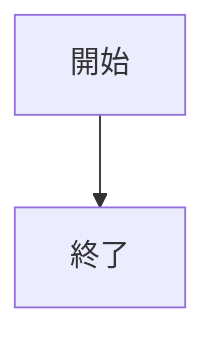

# webpro_06
2024/10/29

## このプログラムについて
1. ```node app.js```を起動する
1. Webブラウザでlocalhost:8080/public/janken.htmlにアクセスする
1. 自分の手を入力する


### ファイル一覧
ファイル名 | 説明 | .ejs
-|-|-
app5.js | プログラム本体 | luck.ejs
public/janken.html | じゃんけん開始の画面 | janken.ejs


```javascript
console.log("hello")
```



```mermaid
flowchart TD;

start["開始"];
end1["終了"];
if{"条件に合うか"};
win["勝ち"];
loose[“負け"];

start --> if;
if -->|yes| win;
win --> end1;
if -->|no| loose;
loose --> end1;
```
