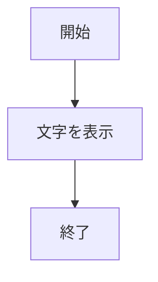
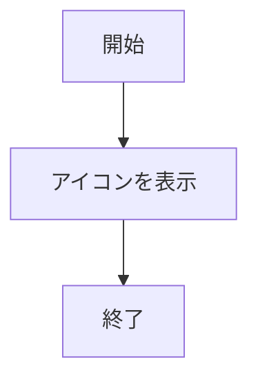
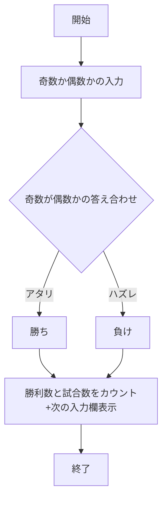
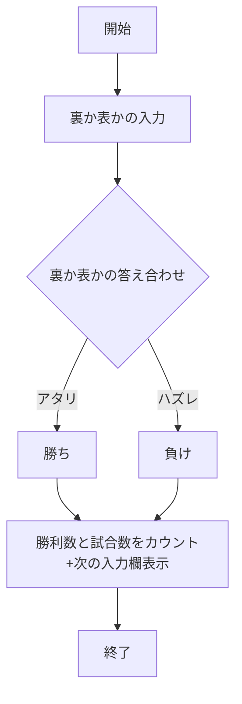

# app5.js内の説明

## 1.hello1とhello2
　「hello　world」と「Bon jour」のメッセージを表示する
```
app.get("/hello1", (req, res) => {
  const message1 = "Hello world";
  const message2 = "Bon jour";
  res.render('show', { greet1:message1, greet2:message2});
});
```
の方法で表示するやり方がhello１
```
app.get("/hello2", (req, res) => {
  res.render('show', { greet1:"Hello world", greet2:"Bon jour"});
});
```
のやり方がhello2


### 使用手順
1. ```node app5.js```を起動する
1. Webブラウザで http://localhost:8080/hello1 にアクセスする
1. Webブラウザで http://localhost:8080/hello2 にアクセスする
1. 文字が表示される

### ファイル一覧
ファイル名 | 説明 | 
-|-
app5.js | プログラム本体 | 
show.ejs | 二つのメッセージを表示　|




## 3.icon
りんごのアイコンを表示させる

### 使用手順
1. ```node app5.js```を起動する
1. Webブラウザで http://localhost:8080/icon にアクセスする
1. アイコンが表示される

### ファイル一覧
ファイル名 | 説明 | 
-|-
app5.js | プログラム本体 | 
icon.ejs | りんごのアイコンを表示　|




## 4.数当て
　PCUが１〜５の中からランダムに数を出すので,入力欄に奇数が偶数がを入れてどっちの数か当てるというゲーム。
### 使用手順
1. ```node app5.js```を起動する
1. Webブラウザで http://localhost:8080/kazuate にアクセスする
1. 入力欄に奇数か偶数かを入力する
1. 送信を押す
1. 結果が表示される

### ファイル一覧
ファイル名 | 説明 | 
-|-
app5.js | プログラム本体(この中に数当てのゲームの中身がある) | 
kasuate.html | 数当てゲームの開始の画面 | 
kazuate.ejs | 結果を表示＋次の入力欄を表示|


```javascript
console.log("hello")
```


## 5.コイントス
　PCUがコイントスを裏か表を言うので,入力欄ぬに裏か表を入れてどっちの面か当てるというゲーム。
### 使用手順
1. ```node app5.js```を起動する
1. Webブラウザで http://localhost:8080/coin にアクセスする
1. 入力欄に裏か表かを入力する
1. 送信を押す
1. 結果が表示される

### ファイル一覧
ファイル名 | 説明 | 
-|-
app5.js | プログラム本体(この中に数当てのゲームの中身がある) | 
koin.html | コイントスの開始の画面 | 
koin.ejs | 結果を表示＋次の入力欄を表示|
